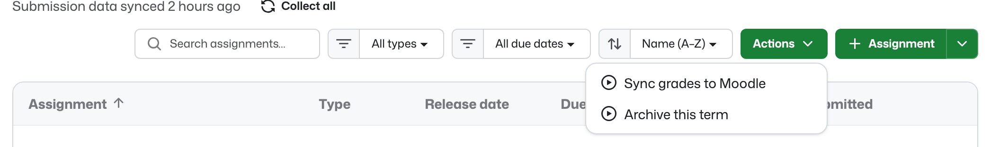
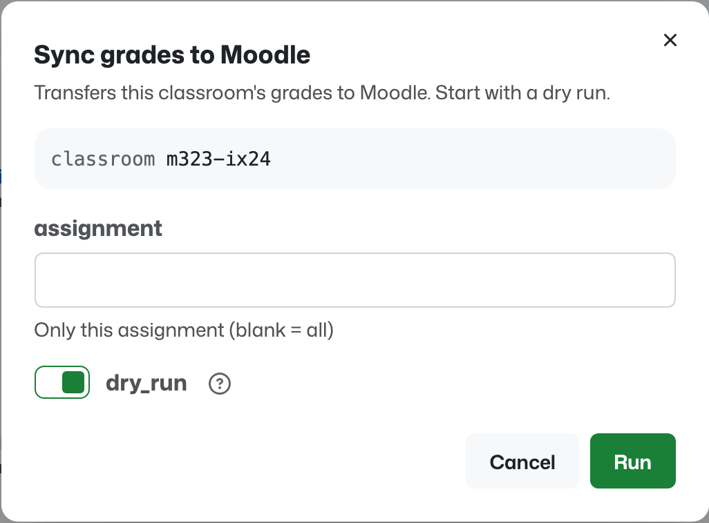

# Manual actions

A classroom's assignments page can offer your own workflows as buttons — a
grade export, an LMS sync, a nightly job you sometimes need to run early.
Classroom 50 ships four workflows in your organization's `classroom50`
repository and drives them itself; anything else you put there is yours, and
this page is how you surface it.

Nothing appears automatically. Classroom 50 can see every workflow in the
repository, but a workflow of yours can do anything — write grades into another
system, mail students, delete branches — so it is offered to a teacher only
because you declared it, in a file you control.

## The short version

Add `<classroom>/actions.json` to your `classroom50` repository:

```json
{
  "schema": "classroom50/actions/v1",
  "actions": [
    {
      "workflow": "moodle-sync.yaml",
      "label": "Sync grades to Moodle",
      "description": "Transfers this classroom's grades to Moodle.",
      "min_role": "teacher",
      "inputs": {
        "classroom": { "policy": "locked", "value": "{{classroom}}" },
        "all_classrooms": { "policy": "hidden" },
        "assignment": { "policy": "shown" },
        "user": { "policy": "hidden" },
        "dry_run": { "policy": "shown", "value": "true" },
        "force": { "policy": "hidden" }
      }
    }
  ]
}
```

Commit it to the default branch. The action shows up in the **Actions** menu on
that classroom's assignments page, for anyone whose role clears `min_role`.



## What goes where

The declaration says **who may run the workflow and what its inputs are allowed
to be**. It never says what type an input has — that stays in the workflow YAML,
where you wrote it. Keeping the two apart is deliberate: if you drop an input
from the workflow, its entry here simply stops mattering, and if you add a
required one, the action reports that it needs configuration instead of failing
on every click.

| Field | Meaning |
| --- | --- |
| `workflow` | File name inside `.github/workflows`, e.g. `moodle-sync.yaml` |
| `label` | Menu entry, and the name shown in the activity banner while the run is in flight |
| `description` | Shown in the dialog. Say what happens outside GitHub |
| `min_role` | `teacher` (default), `hta`, or `ta` |
| `inputs` | Policy per input, keyed by the input name as the workflow declares it |

## The three input policies

| Policy | The teacher sees | The dispatch sends |
| --- | --- | --- |
| `locked` | the value, read-only | your `value` |
| `shown` | an editable field, starting at your `value` or the workflow's own default | what they left in it |
| `hidden` | nothing | nothing — the workflow's own default applies |

`{{classroom}}` in a `value` is replaced with the classroom the action was
started from.

The dialog below is the full example at the end of this page: `classroom` is
locked and renders as text rather than a field, `assignment` is editable,
`dry_run` starts on — and `user`, `all_classrooms` and `force` are declared
`hidden`, so they are not in the form and will not be sent.



**An input you don't list is `hidden`.** That is the one default worth
remembering, and it is why the example above lists inputs it does not use: an
undeclared input is not merely absent from the form, it is absent from the
dispatch. If a *required* input ends up hidden, the action refuses to run and
says so — better than a dialog that 422s every time.

## Why the Moodle example locks `classroom`

`moodle-sync.yaml` takes a `classroom` input and, separately, an
`all_classrooms` switch. A button on the *m323-ix24* assignments page must
transfer *m323-ix24* — not, depending on what someone typed, every classroom in
the organization, into a live Moodle instance, over grades a teacher may have
corrected by hand. No second run takes that back.

So `classroom` is `locked` to `{{classroom}}` and `all_classrooms` is `hidden`.
Not "defaults to the right thing" — structurally unable to be anything else.
Locking is the only policy that guarantees a value the browser cannot change.

The same reasoning does not apply to `assignment` and `user`. They narrow
*within* the classroom, so their widest case is already bounded by the locked
scope; showing or hiding them is a matter of taste.

`dry_run` starts at `true` here on purpose. A first click that shows what would
be transferred, and transfers nothing, is a cheap habit for an action that
writes into another system.

> [!NOTE]
> A declaration is a safety rail on *this* button, not on the workflow. Anyone
> who can open the repository's Actions tab still sees the raw inputs. A
> workflow whose empty input means "everything" should be fixed in the workflow,
> not only fenced off here.

## Who may run it

`min_role` decides who is *offered* the action:

- `teacher` — teachers only. Use this for anything that writes outside GitHub.
- `hta` — teachers and head TAs.
- `ta` — every staff member of the classroom.

This is what the app shows, not what GitHub permits. The real boundary is
Actions write access to the `classroom50` repository: a plain TA is read-only
there, so a dispatch would be rejected by GitHub whatever this file says. Set
`min_role` to describe the tier a workflow *deserves*, and let GitHub enforce
the rest.

## Which workflows can be declared

Any workflow file in `.github/workflows` of your `classroom50` repository that
has a `workflow_dispatch` trigger — including one that takes no inputs:

```yaml
on:
  workflow_dispatch:
```

Not eligible: a `workflow_call`-only helper (student repositories call
`autograde-runner.yaml` that way) and a push- or schedule-only workflow. The
four workflows Classroom 50 ships — `collect-scores`, `regrade`,
`publish-pages`, `autograde-runner` — are refused outright: they have their own
buttons, and a declared copy would sit next to the built-in behaving
differently.

Your own workflows survive a workflow update: updating overwrites the four
scaffolded files, and leaves everything else alone.

## After the run starts

The dialog closes as soon as GitHub accepts the dispatch, and the run appears in
the activity banner at the top of the app, with elapsed time and a link to the
run on GitHub — the same place collect and regrade report. If the dispatch is
*rejected* — no Actions access, a workflow deleted since you declared it — the
dialog stays open and names the reason, because a run that never started has
nothing to show in the banner.

## When something doesn't show up

**No Actions menu at all.** The classroom has no `actions.json`, the file is on
a branch other than the default one, or its `schema` is not exactly
`classroom50/actions/v1`. A file that cannot be parsed reads as "no actions" —
deliberately, so a hand-edit in progress can't surface a half-understood
declaration.

**One action missing.** Your role is below its `min_role`, or the classroom is
archived.

**"can't be run from here".** The `workflow` name doesn't match a file in
`.github/workflows`, or that file has no `workflow_dispatch` trigger. The name
includes the extension, and `.yaml` and `.yml` are different files.

**"can't be run as declared".** One of three things: the workflow requires an
input your declaration leaves hidden (give it a `locked` value or set it to
`shown`); your declaration names an input the workflow doesn't have (a typo, or
an input renamed since — the whole action is refused rather than run with a
scope that would not be sent); or an input is `locked` with no `value`.

**One action is missing but the others work.** That entry failed to parse — an
unknown `min_role`, a policy that isn't one of the three. Entries are read
individually, so a mistake in one costs only that one.

## Full example

A classroom that offers two actions — the Moodle sync above, plus a workflow
that takes no inputs at all:

```json
{
  "schema": "classroom50/actions/v1",
  "actions": [
    {
      "workflow": "moodle-sync.yaml",
      "label": "Sync grades to Moodle",
      "description": "Transfers this classroom's grades to Moodle. Start with a dry run.",
      "min_role": "teacher",
      "inputs": {
        "classroom": { "policy": "locked", "value": "{{classroom}}" },
        "all_classrooms": { "policy": "hidden" },
        "assignment": { "policy": "shown" },
        "user": { "policy": "hidden" },
        "dry_run": { "policy": "shown", "value": "true" },
        "force": { "policy": "hidden" }
      }
    },
    {
      "workflow": "archive-term.yaml",
      "label": "Archive this term",
      "min_role": "teacher",
      "inputs": {
        "classroom": { "policy": "locked", "value": "{{classroom}}" }
      }
    }
  ]
}
```

The machine-readable format is `schemas/actions-v1.schema.json` in this
repository.
